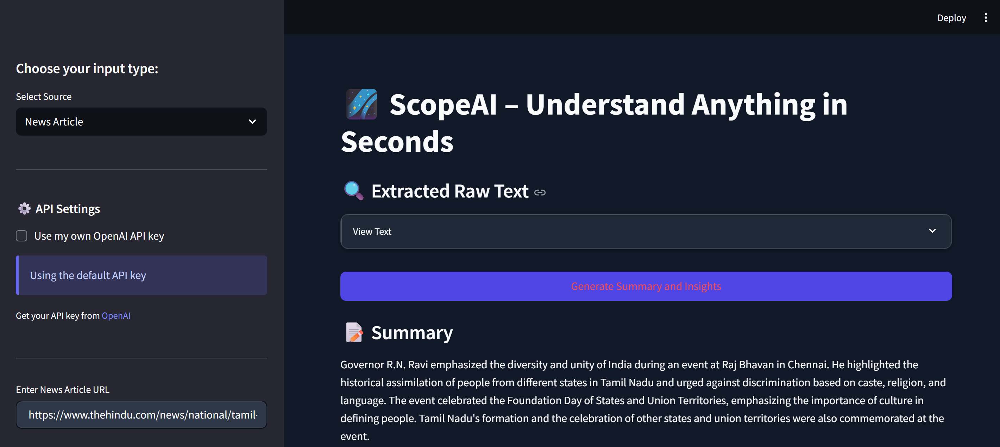

# 📊 ScopeAI – Multi-Source Insight Generator

<div align="center">


</div>

ScopeAI is a multi-source AI insight engine that combines the power of OpenAI's GPT with real-world document and media parsing. With just a link or a file, ScopeAI extracts, summarizes, and interprets complex content, whether it's a PDF, YouTube video, or a live news article.

> "Turn content chaos into clarity in seconds."

---

## 🚀 Features

- 📄 **PDF Summarization** – Extract and summarize long academic or business PDFs
- 📹 **YouTube Transcription + GPT Summary** – Pull transcript from a video and summarize it
- 📰 **News Article Parsing** – Scrape, clean, and summarize live news content
- 🧠 **LLM-Powered Summary** – Built with GPT-3.5 or GPT-4 API integration
- 🔍 **NER + Sentiment Analysis** – Named entity detection and mood insight using spaCy and VADER
- 💡 **Follow-Up Questions** – Insightful prompts generated based on the summary
- ✅ **Streamlit UI** – Responsive sidebar controls with real-time processing
- 🎨 **Custom Dark Theme** – Enhanced UI with professional dark mode styling

---

## 📸 Screenshots

<div align="center">
    
</div>

---

## 🛠️ Tech Stack

<div align="center">

| Category | Technologies |
|----------|-------------|
| **Frontend** |   |
| **LLM** |  |
| **NLP** |  VADER, TextBlob |
| **Parsing** | PyMuPDF, yt-dlp, BeautifulSoup |
| **Backend** |   |

</div>

---

## 📦 Installation

```bash
git clone https://github.com/abhimattx/ScopeAI.git
cd ScopeAI
pip install -r requirements.txt
```

### 🔐 Setup API Key
Create a `.env` file or `secrets.toml`:

```bash
# .env
OPENAI_API_KEY=your_openai_key
```

or

```toml
# .streamlit/secrets.toml
OPENAI_API_KEY = "your_openai_key"
```

---

## ▶️ Run the App

```bash
streamlit run app.py
```

Visit `http://localhost:8501` in your browser to use the app.

---

## 🎨 Custom UI Styling

ScopeAI features a professional dark-themed UI designed for optimal readability and user experience:

- **Dark Mode Interface** – High-contrast dark theme optimized for extended reading sessions
- **Color-Coded Elements** – Entity types, sentiment scores, and insights are color-coded for quick visual parsing
- **Interactive Components** – Enhanced buttons, cards, and expandable sections with hover effects
- **Responsive Layout** – Adapts to different screen sizes while maintaining readability
- **Improved Typography** – Better font rendering and spacing for improved readability
- **Visual Hierarchy** – Clear distinction between different sections and information types

The custom styling is implemented via the `style.css` file, which is automatically loaded when the app starts.

---

## 🧠 How It Works

<div align="center">
    
</div>

ScopeAI takes raw input (PDF, YouTube URL, or article link), extracts the content, sends it to OpenAI's GPT to summarize, then layers it with additional insight:
- Named Entities (People, Places, Orgs)
- Sentiment Analysis
- Follow-up questions

All in a smooth, clean interface.

---

## ✨ Future Features
- [ ] Export analysis to Markdown or PDF
- [ ] Session history with tagging
- [ ] Multi-language support
- [ ] Fine-tuned domain-specific models
- [ ] Collaborative annotations

---

## 🤝 Contributing

Contributions are welcome! Here's how:

1. Fork the Project
2. Create your Feature Branch (`git checkout -b feature/AmazingFeature`)
3. Commit your Changes (`git commit -m 'Add some AmazingFeature'`)
4. Push to the Branch (`git push origin feature/AmazingFeature`)
5. Open a Pull Request

Please open an issue first to discuss major changes.

---

## 📜 License

MIT License © 2024 Abhishek Singh

---

<div align="center">
    <p>If you find ScopeAI useful, please consider giving it a ⭐!</p>
    <p>Built with ❤️ by <a href="https://github.com/abhimattx">Abhishek Singh</a></p>
</div>
